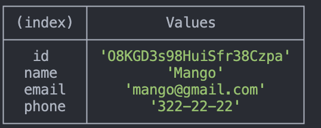

# Node.js Test application in console

## We receive and display the entire list of contacts in the form of a table

```
node index.js -a list
```


## Get a contact by id from the db

```
node index.js -a get -i 05olLMgyVQdWRwgKfg5J6
```


## Add a contact to the db

```
node index.js -a add -n Mango -e mango@gmail.com -p 322-22-22
```



## Remove a contact from the db by id

```
node index.js -a remove -i drsAJ4SHPYqZeG-83QTVW
```


